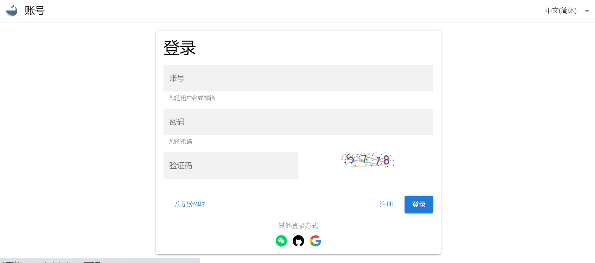
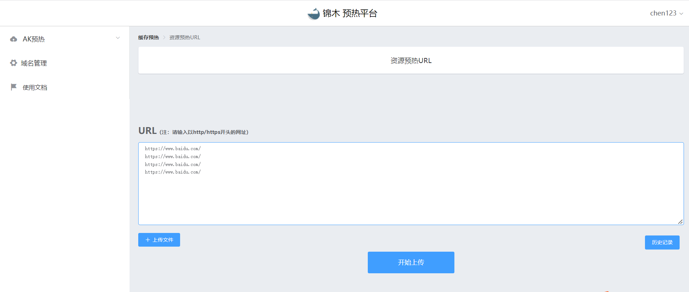
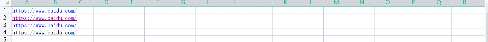
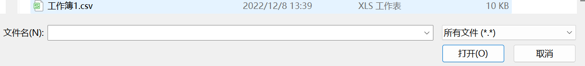
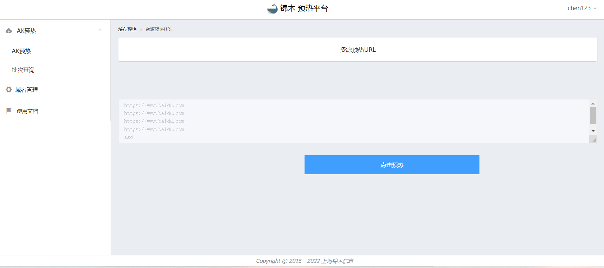
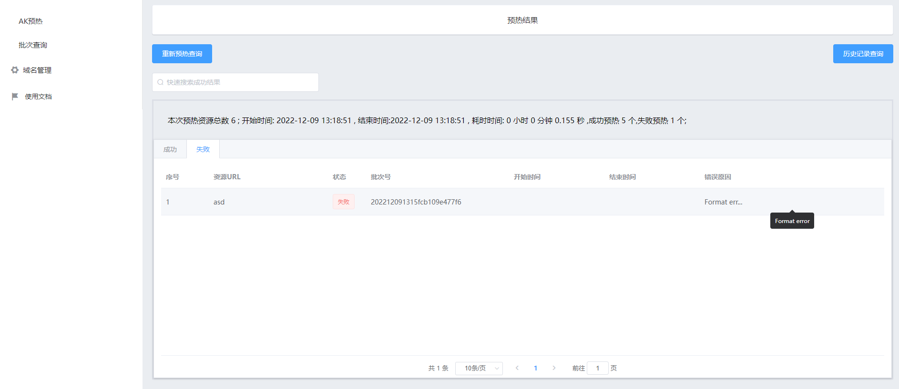
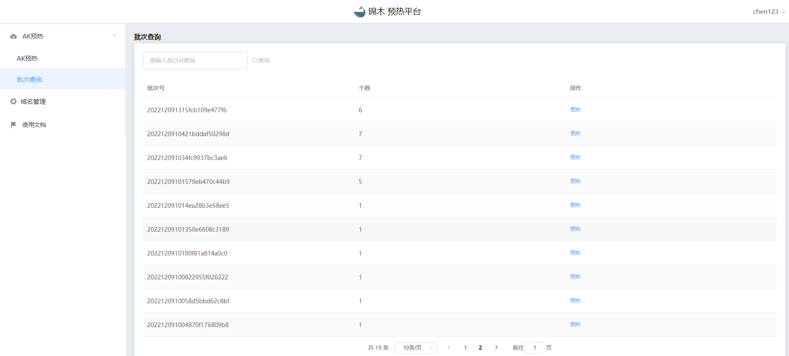

# 使用文档

## 登录

本平台接入本公司auth账号管理系统，具有auth账号即可登录。

1. 点击登录按钮，跳转至auth页面。

   

2. 在auth页面注册账号并登录。

   

---
## 缓存预热

### 1.缓存

#### 手动输入

可通过在URL框内手动输入单个URL进行存储。点击“开始上传”按钮，即可对所输入的URL进行存储。

#### 文件上传

支持.xlsx和.csv文件格式，可将多个URL批量存储。点击“选择文件”按钮，选择文件并上传。

---
### 2.预热

URL存储完成后，可在页面查看此次上传的URL概况。点击“预热”按钮即可对本批次的URL进行预热。

## 结果查询

预热完成后会自动跳转至结果页面，也可通过首页的历史记录查询相关批次的记录。点击“重新预热”按钮可对本批次的URL再次进行预热。

 预热成功显示样例

 预热失败显示样例

---
## 批次处理

每次上传URL时会自动生成一个批次ID，作为本次上传URL的批次号。在批次查询页面可查看用户名下所有的批次ID与对应批次的URL数量。点击“预热”按钮可对对应批次的URL再次进行预热。

---
## 域名管理

在域名管理页面，可配置域名与其对应的IP，类似于curl命令中的--resolve参数。用户可根据自身需求进行配置。

---
## 历史查询

用户可查询当前所有预热的URL记录，并根据成功与失败进行分割显示。只需选择日期即可查询所选范围内的历史记录。对于失败的记录，可在批次管理页面进行再次预热。

---
## 优化内容

平台的各项功能已优化，用户体验更佳，操作更便捷。
