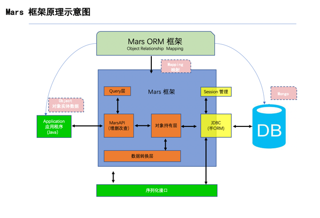
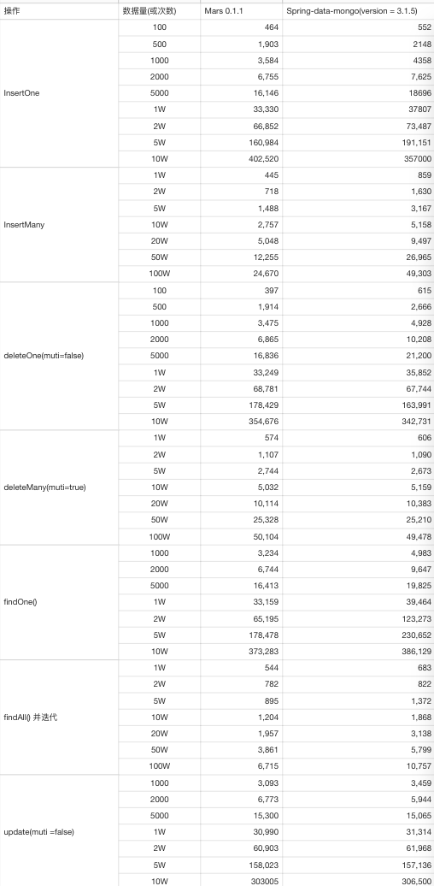
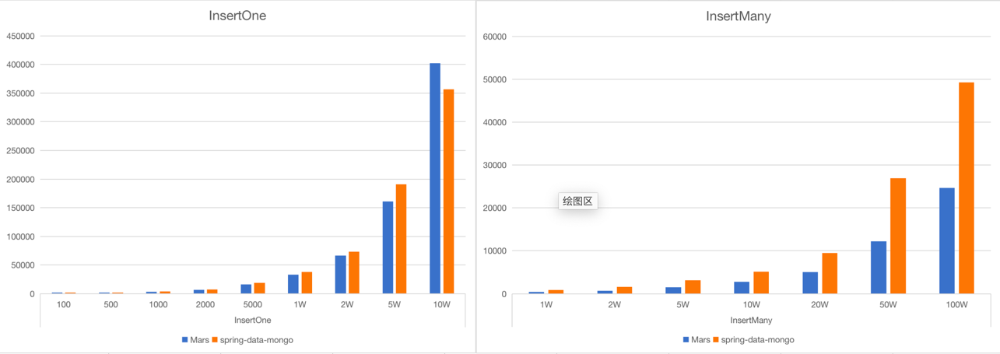
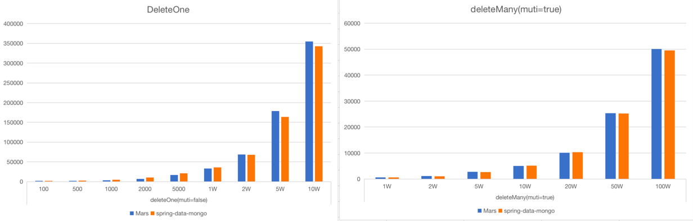
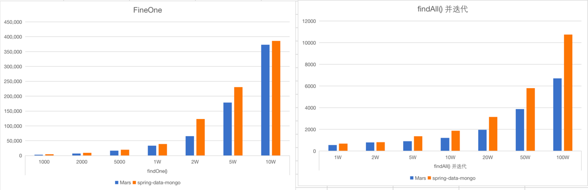
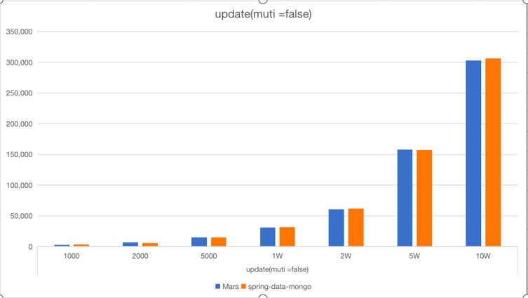

##Mars  性能介绍

### Mars 为什么比spring 快 ？
spring  框架大性能损耗高，同时其底层写入数据库时对象全部由spring 管理，
对象映射采用 Spring-beans 框架 进行数据转换，转为Document  文档后再写入数据库中。
间接影响他的并行能力 及文档上上限 大量数据写入时会直接在转换层 OOM.  

而Mars 直接采用编码解码技术 将对象 直接写入到 MongoDB 数据库中,无需转换。
性能与MongoDB 原生驱动相当,没有性能损耗 。  

###  项目的整体架构

### 性能对比

> 由于本框架底层采用Bson数据流进行传输，所以对于数据的批量插入和删除在性能上较Spring 相比会有一定的提升，数据单位为毫秒，具体的数据如下  

> 性能对比折线图
>
> 注： 柱状图横坐标 (蓝色)为Mars性能测试，(橙色)为spring-data-mongo性能测试
>
> 纵坐标单位时间为毫秒

