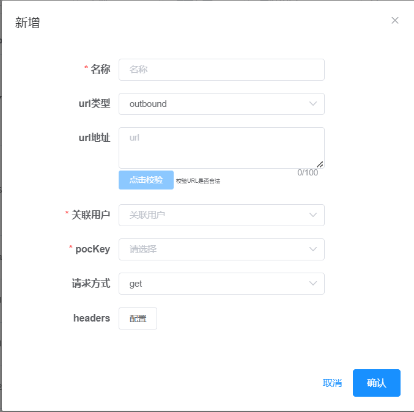
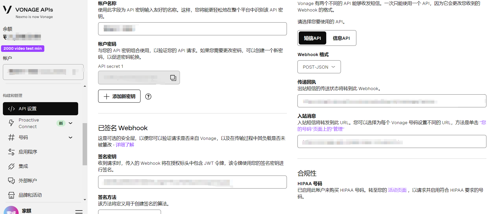

## JMC平台配置WebHookUrl

内部使用，禁止外传

__登录JMC平台`用户管理 -> WebhookUrl对内`__

__新增配置__

__注意点__

1. url类型:outbound
2. pocKey:选择对应的锦木key
3. 请求方式和headers:酌情填写

__保存配置__

填写完信息后点击确认即可

__Vonage配置WebhookUrl__

JMC平台中配置完成后,还需在Vonage中配置, `登录Vonage -> API设置 -> 传递回执配置` ,注意选择webhook格式 `POST-JSON`

