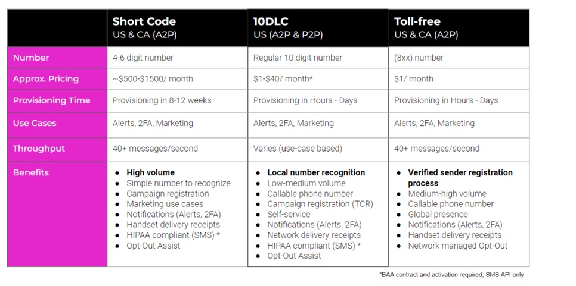

## 常见问题及解答

1. **JMC 计费币种是什么？**
    - 答：欧元。

2. **JMC 付费方式是什么？**
    - 答：预充值。

3. **JMC 业务一般是对接甲方什么职位的？**
    - 答：市场、运维。

4. **首次登陆 JMC 的登陆密码在哪里看？**
    - 答：可在登录账号的邮箱中查看。账号创建完成后，JMC 会向账号邮箱中发送初始密码和登录地址。为保障客户登录账号的安全性，首次登录成功后，系统会强制用户修改初始密码。

5. **JMC账号是否可以用多个邮箱登录？**
    - 答：一个 JMC 账号最多只能用一个邮箱登录，但可以用多个号码登录。

6. **如何处理回填率回复答语？**
    - 答：可以多关注发信情况，若绑定率低及时同步给我们，我们会进一步优化识别规则，提升发信的送达率。

7. **巴基斯坦的SENDER ID有什么要求？**
    - 答：巴基斯坦不同运营商对SENDER ID的要求不同，支持字母加数字，推荐使用不超过6位的字母加数字的SENDER ID。

8. **台湾发信有哪些要求？**
    - 答：需要提供发信模板进行通道报备，若短信内容含有URL，每个URL均需报备。

9. **申请sender-id会导致价格上涨吗？**
    - 答：Vonage默认使用国际通道，有些国家申请固定SID价格会上涨，因为通道不一样，默认是alpha通道，即非注册SID通道。

10. **新客户如何接入？**
    - 答：走JMC平台发信的流程包括客户填写申请表、技术人员在VONAGE平台创建SUB-KEY、根据申请表发信国家规则创建SENDER ID信息、在JMC平台创建JMC账号并绑定VONAGE KEY信息、销售联系商务填写飞书申请预充值。走VONAGE平台发信的流程包括客户填写申请表、技术人员在VONAGE平台创建SUB-KEY和用户账号、根据申请表发信国家规则创建SENDER ID信息、销售联系商务填写飞书申请预充值。

11. **号码购买流程是怎样的？**
    - 答：跟客户收集国家、号码使用时长、发信类型等信息，然后将信息反馈给销售，由销售提交购买申请。

12. **多个业务一个主体如何管理？**
    - 答：可以使用不同的sender-id（适合不需要注册senderID的国家，如巴西）、不同的JMC key（独立查询）或者不同的账号（计费独立）。

13. **如何禁用某个key的短信或者语音功能？**
    - 答：可以针对某个key配置错误的webhook来禁用短信或者语音。当配置webhook后，调用短信或语音接口时，Vonage会预先校验webhook，若webhook调用失败，则API请求直接失败。

14. **如何隐藏key中敏感信息？**
    - 答：创建sub key后，需要隐藏API响应结果的单价、sub key的余额、webhook的单价信息。

15. **开账户流程和周期是怎样的？**
    - 答：一个主体理论上可以开通无限个账号，但账号之间独立无关联。收信价格表如下。开通账号流程很快，通常一天内完成，但在不同国家地区发信需要申请相应资料，具体时间由申请时间决定。

16. **韩国的验证码编码格式有什么注意事项？**
    - 答：韩国消息变量传递中使用Data Encoding 8（通常用于Unicode和特殊字符和语言，如中文、阿拉伯语等），导致用户端显示异常。建议API调用中传递编码纯文本，通过传递“type”:“text”，而不是“type”:“unicode”。

17. **语音 Voice API 的调用流程是怎样的？**
    - 答：基本步骤包括创建账号、充值、买号码、创建application、下载Vonage CLI。购买号码在[号码购买页面](https://dashboard.nexmo.com/buy-numbers)进行。创建application在[应用管理页面](https://dashboard.nexmo.com/applications)进行，启用voice功能并下载private key。Vonage CLI的安装指南在[CLI安装指南](https://developer.vonage.com/en/messages/code-snippets/install-cli)。发送语音通知的基本发送方式是TTS（text to speech），测试方法请参考[TTS调用](https://developer.vonage.com/en/voice/voice-api/code-snippets/making-calls/make-an-outbound-call-with-ncco?source=voice)。接收用户按键请参考[IVR指南](https://developer.vonage.com/en/voice/voice-api/guides/interactive-voice-response?source=voice)和[高级IVR](https://developer.vonage.com/en/voice/voice-api/guides/advanced-ivr?source=voice)。

18. **创建VONAGE账号时如何设置权限？**
    - 答：需要在创建账号时根据业务需求设置相应的权限。

19. **如何配置SIP？**
    - 答：购买SIP号码后，在[SIP接入点](https://dashboard.nexmo.com/sip-trunking)创建SIP接入点，获取SIP所需参数。接入点URL为sip-us.vonage.com (AMER), sip-eu.vonage.com (EMEA), sip-ap.vonage.com (APAC)，用户名为APIKEY，密码为Secret，主叫号码为购买的号码。

20. **同账号之间如何迁移号码？**
    - 答： 请联系锦木进行迁移号码

21. **跨账号如何迁移号码？**
    - 答：源账号发送邮件申请号码转移到新key。在新账号中重新创建短信和语音配置。锦木技术在新账号中设置新key的权限，讨论key余额信息：是否充值等。

22. **子key是否可以共享使用主key的号码？**
    - 答：如果SubAPI key具备共享LVN的功能，则可以使用主账号的号码，可以开case进行申请操作。

23. **语音并发收费标准是什么？**
    - 答：语音并发收费标准取决于具体使用情况和国家/地区的资费标准。

24. **TFN号码发送速度是多少？**
    - 答：30 条短信/秒。toll free发送的速度是基于账号限制的，买多个号码是共享发送速度的。

25. **美国或者加拿大的发信号码有何区别？**
    - 答：长号码需要注册DLC，每天发送250条，注册后立即可用；短代码发送速度为30条短信/秒，申请周期为6-8周；TFN发送速度为30条短信/秒，申请周期为3-7个工作日。

26. **美国或加拿大的发信政策有哪些要求？**
    
    - 答：发送到美国和加拿大的短信需要申请注册10DLC或者TFN（Toll-Free Number）才能发送短信的业务。如果是事务性短信提醒类的短信，注册TFN即可。详细规定请查阅：[Vonage政策说明](https://api.support.vonage.com/hc/en-us/articles/360055483251-Verified-Toll-Free-Numbers-TFN-US-and-Canada)。测试步骤包括注册Vonage账号、购买US的TFN号码、申请TFN验证以及正式上线发送短信。
    
27. **如何进行号码校验？**
    
    - 答：Number insight有不同版本：v1和v2。v1分为basic，standard，advanced。在advanced版本中有不同的参数用于获取号码的实时状态。用于注册时确认号码是否有欺诈嫌疑，推荐使用v2的fraud score。首次发送营销短信前，推荐使用v1 advanced + real time data，大多数国家查询费用比发送费用要贵，数据覆盖情况需要自行验证。详细信息请参考[Number insight文档](https://developer.vonage.com/en/number-insight/overview)。空号检测使用Number insight v1 advanced版本或v2的fraud score，价格为€0.0300。
    
28. **如何校验号码归属地？**
    - 答：Number insight的basic版本没有号码归属地校验功能，standard和advanced版本有。

29. **韩国短信退订问题？**
    - 答：[韩国短信退订参考发信规则](https://api.support.vonage.com/hc/en-us/articles/204017213-South-Korea)。 退订需要客户自行打电话退订

30. **澳大利亚的发信？**

    - 答：
     *注：购买的Vonage号码，就是发信号码。*
      
       **步骤1**：贵司确定购买号码用途及购买号码个数。申请号码预计需要一天。
      
       **步骤2**：技术部门购买号码成功后，根据贵司资料进行申请SenderID。申请  SenderID预计需要一周。
      
       **步骤3**：对接进行JMC发短信。
      
       或
       如果您注册senderID为xxxx，这种情况不需要使用号码也可以进行发信
       如果使用购买的号码作为senderid，则每一个号码都是一个独立的senderID


31. **美国/加拿大发送短信？**

    - 答：
      

     

    - **10位长号码**：需要注册DLC，未注册任何认证的有250条每天限制。注册后，可以协商配置每秒并发量。
    - **TFN号码**：30条短信/秒，申请号码周期为3-7个工作日。

     看您需要购买什么类型的号码进行发信。

     购买TFN号码申请材料需要： 参考：[Verified Toll-Free Numbers (TFN) - US and Canada](https://api.support.vonage.com/hc/en-us/articles/360055483251-Verified-Toll-Free-Numbers-TFN-US-and-Canada)

32. **俄罗斯senderID申请？**

    - 答：俄罗斯的senderID需要注册费50欧，每个月服务费50欧

33. **发信接口安全性？**

    - 答：可使用应用发信接口，该接口使用key和密钥进行身份认证，同时可以配置IP白名单


34. **vonage平台支持号码的企业认证吗？**
    - 答：号码在Vonage平台上是以租用形式提供的。因此，这些号码的所有权归属于Vonage，用户仅拥有使用权。此外，这些号码无法进行企业认证，只能作为租用号码供客户长期使用。
    
        如果想做显示名的话，是可以的 [CNAME](https://api.support.vonage.com/hc/en-us/articles/4407994930964-Can-I-display-my-name-on-the-receiving-party-s-phone-for-outbound-calls)
    
        如果需要填写认证，归属如下：
    
        ```
        TFN 号码信息如下：
        "original_carrier": {
        "network_code": "US-TOLL-FREE",
        "name": "United States Toll Free",
        "country": "US",
        "network_type": "landline_tollfree"
        },
        
        US 号码：
        "network_code": "US-VIRTUAL-VONAGE",
        "name": "Vonage Network Inc.",
        "country": "US",
        "network_type": "virtual"
        ```

35. **vongae的sip源ip？**
    
    - 答：
    
     216.147.0.1  216.147.0.2  216.147.1.1  216.147.1.2  216.147.2.1  216.147.2.2  216.147.3.1  216.147.3.2  216.147.4.1  216.147.4.2    216.147.5.1  216.147.5.2
