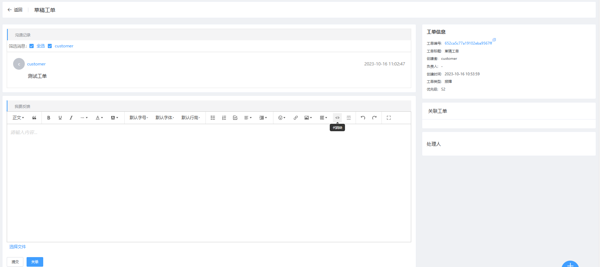
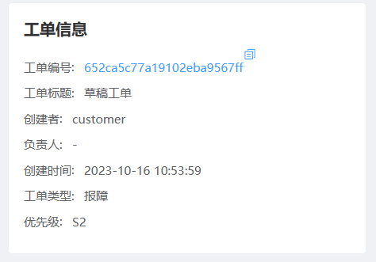
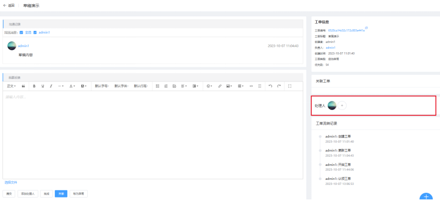
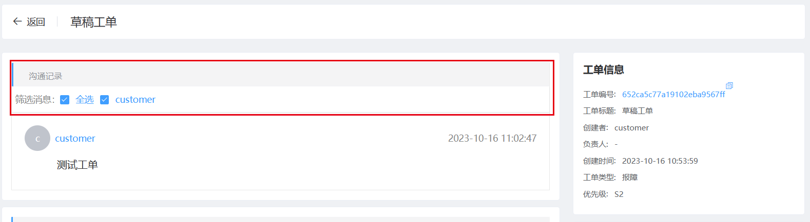
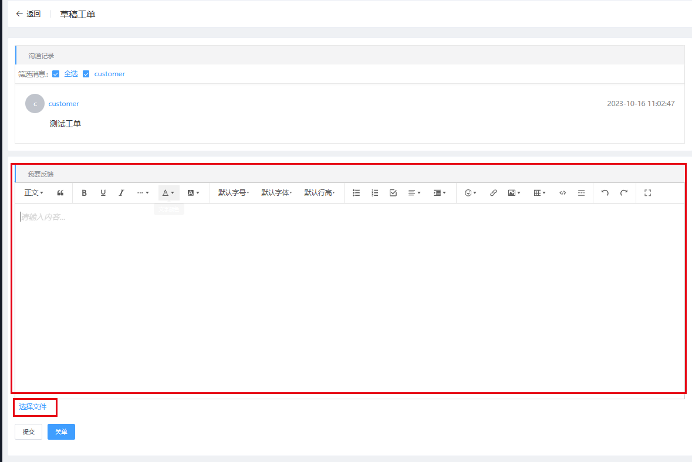

### 工单详情

__点击进入工单详情__

__工单详情页面__

__工单信息__

刚创建的工单处于新建阶段,请耐心等待处理人员开启此工单进行处理,在未开启处理前工单没有负责人

__关联工单__

点击关联工单中的超链跳转到对应工单详情页面

__工单处理人__

包含您工单的负责人及协助处理人,若为新建未开启处理的工单则没有值

__筛选沟通记录__

客户可从上方勾选框选择性的显示自己想看到的人发送的消息

__发消息及上传附件__

客户可在下方富文本框内编辑消息,点击选择文件上传附件,最后点击下方提交即可发送沟通记录

__关闭工单__

客户也可选则自行关闭工单

